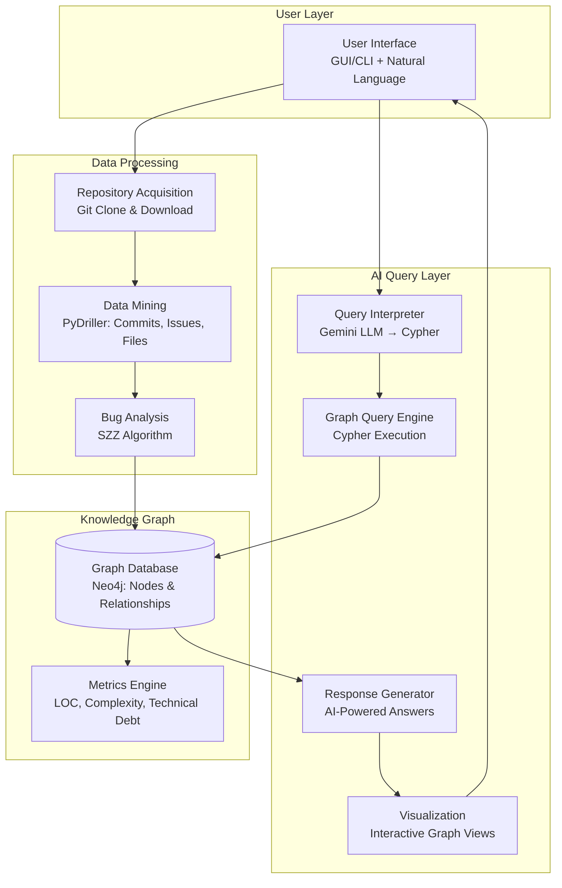

# GitIntel: Conversational Intelligence for Comprehensive GitHub Repository Analysis

---

## Slide 1: Title & Overview

### GitIntel: Conversational Intelligence for Comprehensive GitHub Repository Analysis

**Md Mostafizur Rahaman**  
*Proposal Presentation*

**Date:** November 4, 2025

---

## Slide 2: Problems Faced by Users

### Challenges in Analyzing Large GitHub Repositories

- **Overwhelming Data Volume**: Thousands of commits, hundreds of files, multiple contributors
- **Difficulty Tracking Changes**: Hard to identify which parts change most, who contributes what
- **Time-Consuming Analysis**: Manual browsing through commits and files required
- **Lack of Insights**: Existing tools provide raw data or require deep technical expertise
- **Poor Accessibility**: Non-technical users (project managers, researchers) struggle to understand evolution
- **No Natural Interaction**: No easy way to ask questions like "Which module changed the most?"

**Impact**: Developers, researchers, and managers waste time and make uninformed decisions

---

## Slide 3: Proposed Solution Overview

### GitIntel: AI-Powered Repository Intelligence

**Core Concept**: Desktop-based tool that extracts data from GitHub repositories, builds Knowledge Graphs, and answers natural language questions.

**Key Features**:
- **Data Extraction**: Uses PyDriller and SZZ algorithm for accurate commit-issue relationships
- **Knowledge Graph**: Neo4j-based storage for relationship data (commit-issue links)
- **AI Chat Interface**: Natural language queries in Bengali/English
- **Advanced Analysis**: LOC, complexity, technical debt calculations
- **Graph Visualization**: Interactive views of repository relationships
- **User-Friendly**: Designed for non-technical users like project managers

**Goal**: Easy repository insights without manual data sifting

---

## Slide 4: Technical Architecture

### High-Level Architecture Diagram

**Data Flow**: User Input → Repository Processing → Data Mining → Bug Analysis → Graph Storage → Metrics → AI Query → Graph Search → Intelligent Response → Visualization

---

## Slide 5: Key Technologies

### Technology Stack

| Component | Technology | Purpose |
|-----------|------------|---------|
| **Language** | Python 3.13+ | Core development |
| **Data Extraction** | PyDriller, GitPython | Repository mining |
| **AI Engine** | Google Gemini | Natural language processing |
| **Graph Database** | Neo4j | Knowledge graph storage |
| **Bug Detection** | SZZ Algorithm | Bug commit identification |
| **GUI Framework** | Tkinter | Desktop interface |
| **Data Processing** | Pandas, OpenPyXL | Analysis & reporting |
| **Version Control** | Git, GitHub | Repository access |

---

## Slide 6: Solution Benefits

### Why GitIntel is Better

- **Conversational Interface**: Ask questions naturally ("Which developer contributed most?")
- **Accurate Relationships**: SZZ algorithm ensures correct bug-fix linkages
- **Graph-Based Insights**: Visual understanding of repository structure
- **Multi-Language Support**: Bengali and English queries
- **Performance Optimized**: Commit limits for large repositories
- **User-Centric Design**: For project managers, not just developers
- **Comprehensive Analysis**: LOC, complexity, technical debt in one tool

**Target Users**: Project managers, researchers, developers needing quick insights

---

## Slide 7: Implementation Timeline

### Development Phases

1. **Phase 1**: Core data extraction with PyDriller (2 weeks)
2. **Phase 2**: SZZ algorithm integration (1 week)
3. **Phase 3**: Neo4j graph building (2 weeks)
4. **Phase 4**: Gemini AI integration (2 weeks)
5. **Phase 5**: Desktop GUI development (2 weeks)
6. **Phase 6**: Testing and optimization (2 weeks)

**Total Timeline**: 11 weeks

---

## Slide 8: Expected Outcomes

### Project Impact

- **Easy Repository Analysis**: No more manual commit browsing
- **Faster Decision Making**: Quick insights for project managers
- **Better Collaboration**: Understanding of team contributions
- **Technical Debt Awareness**: Automated complexity and debt tracking
- **Educational Value**: Learning tool for repository analysis techniques

**Success Metrics**: User adoption, accuracy of insights, performance benchmarks

---

## Slide 9: Conclusion

### GitIntel: Revolutionizing Repository Intelligence

**Summary**: GitIntel bridges the gap between raw repository data and actionable insights through AI-powered conversational analysis.

**Unique Value**: Combines graph databases, bug detection algorithms, and natural language processing for comprehensive repository understanding.

**Future Potential**: Extensible to other version control systems, integration with CI/CD pipelines.

**Thank You!**

Questions?</content>
<parameter name="filePath">d:\GitIntel\GitIntelProject\PROPOSAL_PRESENTATION.md