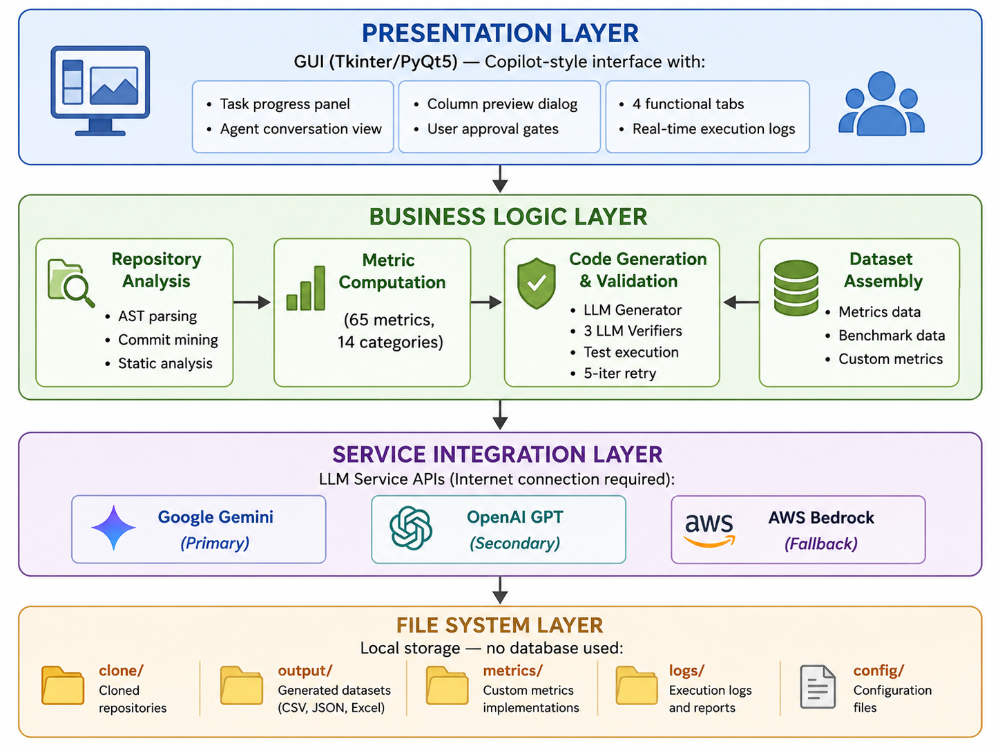
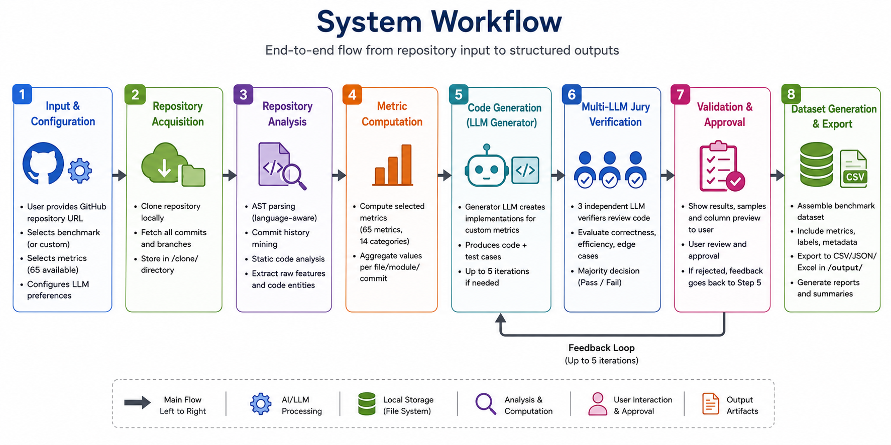
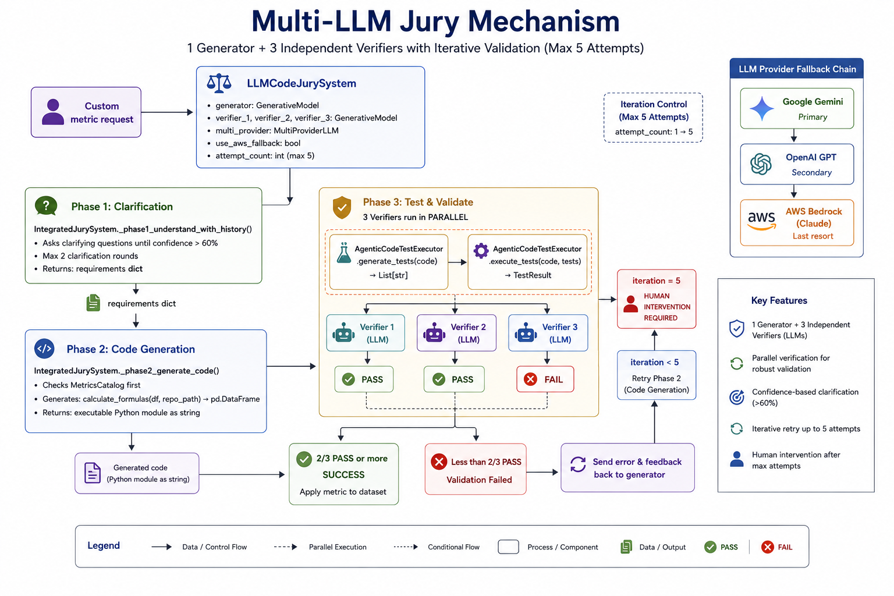
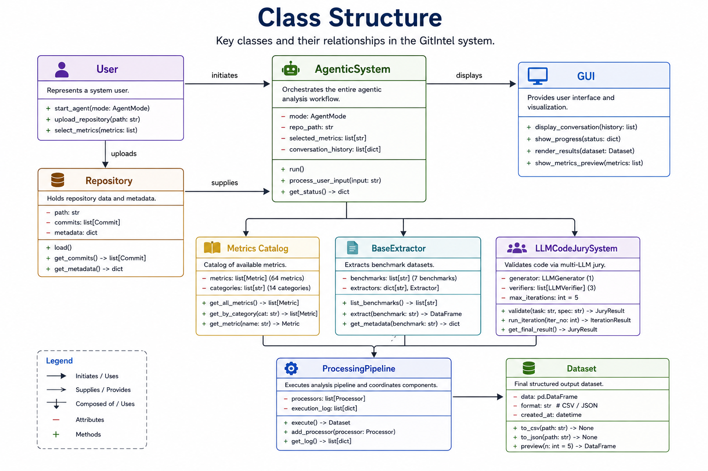
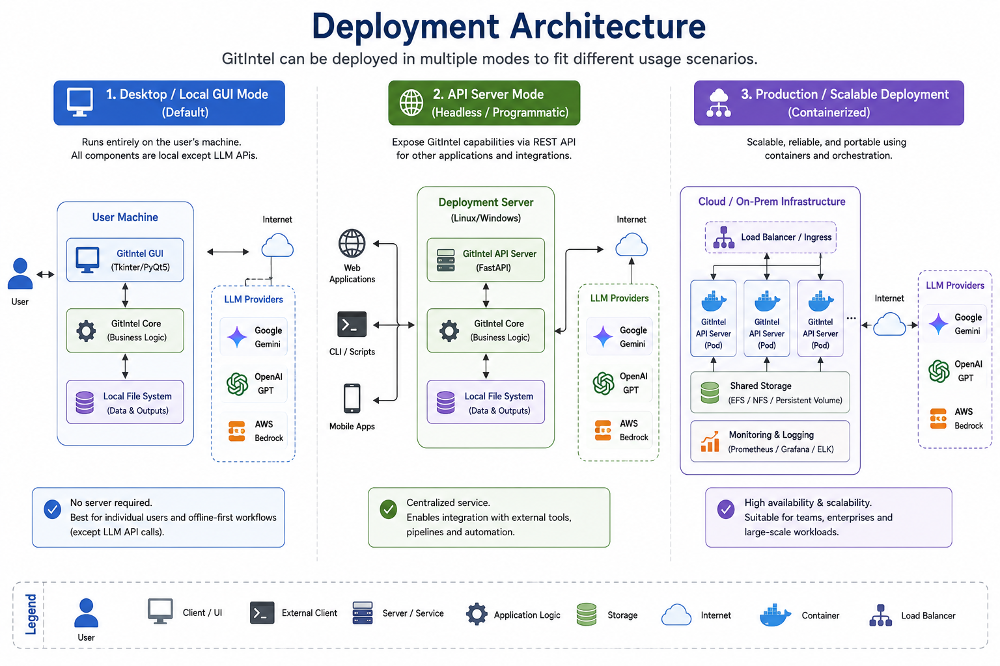

# GitIntel

## Conversational Intelligence for Comprehensive GitHub Repository Analysis

**Motivation:** Modern software engineering research requires large-scale, high-quality datasets from real-world repositories. Constructing such datasets manually is labor-intensive, error-prone, and difficult to reproduce — especially for researchers in developing regions with limited resources. GitIntel democratizes access to research-grade repository analytics by providing an intelligent, fully automated pipeline.

---

## Table of Contents

- [Abstract](#abstract)
  - [Project Architecture](#project-architecture)
    - [Layered Architecture](#layered-architecture)
    - [System Workflow](#system-workflow)
    - [Multi-LLM Jury Mechanism](#multi-llm-jury-mechanism)
    - [Class Structure](#class-structure)
    - [Deployment Architecture](#deployment-architecture)
- [Features](#features)
- [Prerequisites](#prerequisites)
- [Installation](#installation)
- [Environment Configuration](#environment-configuration)
- [Running the Application](#running-the-application)
  - [GUI — Ask Mode](#gui--ask-mode)
  - [GUI — Agent Mode](#gui--agent-mode)
  - [API Server Mode](#api-server-mode)
- [GUI Tabs Reference](#gui-tabs-reference)
- [Build Standalone EXE](#build-standalone-exe)
  - [Full Redeploy Process](#full-redeploy-process)
  - [Clean Rebuild After Code Changes](#clean-rebuild-after-code-changes)
- [Project Structure](#project-structure)
- [Metrics Catalog (65 Metrics)](#metrics-catalog-65-metrics)
- [Benchmark Datasets (7 Benchmarks)](#benchmark-datasets-7-benchmarks)
- [Output Formats](#output-formats)
- [Configuration Reference](#configuration-reference)
- [Troubleshooting](#troubleshooting)
- [License](#license)

---

## Abstract

Software engineering research increasingly depends on large-scale GitHub repository data, yet extracting research-quality datasets from real-world codebases remains time-consuming, technically demanding, and error-prone. GitIntel introduces an autonomous AI-powered solution that transforms any GitHub repository into structured, benchmark-ready datasets, dramatically reducing the barrier to advanced repository analysis.

The system natively supports seven widely adopted research benchmarks — Defects4J, Bugs.jar, PROMISE, CodeXGLUE, CodeSearchNet, ManySStuBs4J, and Sourcerer — while computing comprehensive software metrics across lines of code, CK metrics, complexity measures, Halstead metrics, and more. A novel **multi-LLM jury architecture** (one generator + three independent judges) validates custom metric implementations through consensus-based verification, ensuring dataset reliability even when processing complex repository histories.

## Project Architecture

GitIntel follows a four-layer architecture as defined in the SRS:



### Layered Architecture

- **Presentation Layer:** GUI (Tkinter/PyQt5) — Copilot-style interface with:
  - Task progress panel
  - Agent conversation view
  - Column preview dialog
  - User approval gates
  - 4 functional tabs
  - Real-time execution logs

- **Business Logic Layer:**
  - Repository Analysis (AST parsing, commit mining, static analysis)
  - Metric Computation (65 metrics, 14 categories)
  - Code Generation & Validation (LLM Generator, 3 LLM Verifiers, Test execution, 5-iter retry)
  - Dataset Assembly (Metrics data, Benchmark data, Custom metrics)

- **Service Integration Layer:**
  - LLM Service APIs (Google Gemini - Primary, OpenAI GPT - Secondary, AWS Bedrock - Fallback)

- **File System Layer:**
  - Local storage (clone/, generated_datasets/, temp/, .env)

### System Workflow

The complete end-to-end workflow follows six sequential modules:



1. **Module 1:** Repository Clone & Mode Selection
   - Remote URL → Auto-clone OR Local Path → Direct use
   - Validate Repository
   - Ask Mode (confirm each step) OR Agent Mode (autonomous, minimal user interaction)

2. **Module 2:** Requirement Specification
   - User provides natural language requirement via GUI
   - LLM parses and identifies: Benchmark metrics, Predefined metrics, Custom metrics
   - Iterative clarification until fully specified

3. **Module 3:** Define Metrics Generation
   - For each requested metric: MetricsCatalog.validate_metric(name)
   - Found? → Use existing implementation
   - No → Flag as missing → Route to Multi-LLM Jury

4. **Module 4:** Benchmark Dataset Generation
   - BaseExtractor subclass per benchmark: Defects4J / Bugs.jar / PROMISE / CodeXGLUE / CodeSearchNet / ManySStuBs4J / Sourcerer
   - Extracts: buggy-fixed code pairs, commit-level annotations, historical defect information

5. **Module 5:** Multi-LLM Jury Evaluation (only for custom / missing metrics)
   - LLM GENERATOR: Generates Python code for the metric
   - VERIFIER 1, VERIFIER 2, VERIFIER 3: Generate & run unit tests
   - Consensus Check: ≥ 2/3 pass? → Metric approved OR < 2/3 pass → Iteration < 5? → Fix & retry OR iteration = 5 → HUMAN INTERVENTION REQUIRED

6. **Module 6:** Dataset Generation & Export
   - ProcessingPipeline.execute(repo_data)
   - Compute all 65 selected metrics
   - Apply custom metric code from jury
   - Merge benchmark data + predefined metrics
   - Apply custom metrics
   - Dataset.export_csv() / export_json()

### Multi-LLM Jury Mechanism

The jury system is the core innovation of GitIntel. It uses **1 code generator + 3 independent verifiers**, all running on LLMs (Google Gemini / AWS Bedrock):



- **Phase 1:** Clarification - Asks clarifying questions until confidence > 60%
- **Phase 2:** Code Generation - Checks MetricsCatalog first, then writes code
- **Phase 3:** Test & Validate (3 verifiers in parallel) - Independent unit test generation + execution

**LLM provider fallback chain:** Google Gemini → OpenAI GPT → AWS Bedrock (Claude)

### Class Structure

Key classes and their relationships (from SRS CRC analysis):



- **User** initiates → **AgenticSystem** displays → **GUI**
- **Repository** supplies → **Metrics Catalog** (64 metrics, 14 categories)
- **BaseExtractor** (7 benchmarks)
- **LLMCodeJury System** (1 generator + 3 verifiers)
- **ProcessingPipeline** (-processors[], -execution_log)
- **Dataset** (-data: pd.DataFrame, -CSV / JSON)

### Deployment Architecture

GitIntel runs entirely on the **user's local machine**. No server or database is required:



- **GitIntel Desktop Application**
  - GUI Layer (Tkinter / PyQt5)
  - Processing Engine (Analysis, Metrics, Code Gen)
  - Core Components (AgenticSystem, Multi-LLM Jury, Data Pipeline)
- **Local File System:** clone/, generated_datasets/, .env
- **External Services:** Google Gemini (Primary), OpenAI GPT (Secondary), AWS Bedrock (Fallback)

> **No database is used.** All data is stored on the local file system.

---

## Features

**Normal (Core) Features:**

- Accept Git repositories by remote URL (auto-clone) or existing local path
- Static analysis of source code and full commit history
- Compute 64 predefined software engineering metrics across 14 categories
- Generate datasets compatible with 7 established research benchmarks
- Manually select any combination of metrics and benchmarks

**Expected (Standard) Features:**

- Natural language requirement interpretation via LLM
- Iterative clarification until requirements are fully specified
- Automatic detection of missing vs. available metrics
- Two execution modes: Ask Mode (step-by-step control) and Agent Mode (autonomous)
- Fully automated dataset generation from scratch for any repository

**Exciting (Differentiating) Features:**

- **Multi-LLM jury validation**: 3 independent LLMs validate all generated code
- **Automated unit test generation**: each verifier independently writes and executes tests
- **Consensus-based approval**: metric accepted only if ≥ 2/3 verifiers confirm
- **Iterative self-correction**: up to 5 automated refinement cycles before escalation
- **Human-in-the-loop escalation**: explicit request only after automated validation fails
- **Standalone EXE**: PyInstaller build for distribution without Python

---

## Prerequisites

| Requirement | Version | Notes                                                       |
| ----------- | ------- | ----------------------------------------------------------- |
| Python      | 3.8+    | 3.10 or 3.11 recommended                                    |
| Git         | any     | Required for repository cloning and history analysis        |
| LLM API key | —      | Google Gemini (primary); AWS Bedrock as fallback            |
| OS          | any     | Windows 10/11, macOS, Linux Ubuntu 20.04+                   |
| Java        | 8+      | Optional — needed only for Java repository static analysis |

**LLM API — minimum one required:**

- Google Gemini API key (`GOOGLE_API_KEY`) — primary, free tier available
- AWS Bedrock access (`AWS_ACCESS_KEY_ID` + `AWS_SECRET_ACCESS_KEY`) — fallback
- OpenAI API key (`OPENAI_API_KEY`) — secondary fallback

---

## Installation

### 1. Clone the repository

```bash
git clone https://github.com/your-org/GitIntel.git
cd GitIntel
```

### 2. Navigate to the GUI directory

```bash
cd GitIntelProject/Dataset/gui
```

### 3. Create and activate a virtual environment

**Windows:**

```bash
python -m venv venv
venv\Scripts\activate
```

**Linux / macOS:**

```bash
python -m venv venv
source venv/bin/activate
```

Your prompt will show `(venv)` when active.

### 4. Upgrade pip

```bash
python -m pip install --upgrade pip
```

### 5. Install core dependencies

```bash
pip install -r requirements.txt
```

### 6. Install additional backend dependencies

```bash
pip install boto3 botocore lizard radon fastapi uvicorn pyinstaller
```

**Full dependency reference:**

| Package                   | Purpose                                         |
| ------------------------- | ----------------------------------------------- |
| `google-generativeai`   | Google Gemini — primary LLM                    |
| `boto3` / `botocore`  | AWS Bedrock (Claude) — LLM fallback            |
| `pandas` / `numpy`    | Data processing and dataset export              |
| `GitPython`             | Git repository cloning and commit history       |
| `PyDriller`             | Commit history mining and code churn extraction |
| `lizard`                | Cyclomatic complexity analysis                  |
| `radon`                 | Maintainability index, Halstead metrics         |
| `PyQt5`                 | Qt-based GUI (alternative to Tkinter)           |
| `fastapi` / `uvicorn` | REST API server                                 |
| `python-dotenv`         | `.env` file loading                           |
| `pyinstaller`           | Build standalone Windows/macOS/Linux executable |

---

## Environment Configuration

Create a `.env` file in `GitIntelProject/Dataset/` (one level above `gui/`):

```bash
# ── LLM Providers ────────────────────────────────────────
# Primary: Google Gemini (free tier available)
GOOGLE_API_KEY=your_google_api_key

# Fallback: AWS Bedrock (Claude)
AWS_ACCESS_KEY_ID=your_aws_access_key_id
AWS_SECRET_ACCESS_KEY=your_aws_secret_access_key
AWS_DEFAULT_REGION=us-east-1

# Optional: OpenAI (secondary LLM provider)
OPENAI_API_KEY=your_openai_api_key

# ── Repository Access ────────────────────────────────────
# Increases GitHub API rate limit for large-scale cloning
GITHUB_TOKEN=your_github_personal_access_token

# ── Optional: Neo4j (knowledge graph visualization) ──────
NEO4J_URI=neo4j+s://your-instance.databases.neo4j.io
NEO4J_USERNAME=neo4j
NEO4J_PASSWORD=your_neo4j_password
```

> Never commit `.env` to version control. It is included in `.gitignore`.

---

## Running the Application

### GUI — Ask Mode

Ask Mode requests user confirmation before executing each major step, ensuring full visibility and control:

```bash
# From GitIntelProject/Dataset/gui/ with venv active
python main.py
```

1. Select **Ask Mode** from the mode selector
2. Load a repository (browse local or enter remote URL)
3. Type your dataset requirement in natural language
4. Confirm each step: repository validation → metric selection → dataset generation
5. Review column preview before final export

### GUI — Agent Mode

Agent Mode operates autonomously. The system proceeds end-to-end and only pauses when ambiguities arise or human intervention is required:

1. Select **Agent Mode**
2. Provide repository + high-level requirement (e.g. `"Generate bug prediction dataset with Defects4J and cyclomatic complexity"`)
3. GitIntel handles everything: NL parsing → metric resolution → code generation → jury validation → dataset export

### API Server Mode

```bash
# From GitIntelProject/Dataset/
uvicorn api.server:app --host 0.0.0.0 --port 8000 --reload
```

API docs available at `http://localhost:8000/docs`.

**Endpoints:**

| Method   | Path              | Description                   |
| -------- | ----------------- | ----------------------------- |
| `GET`  | `/api/health`   | Health check                  |
| `GET`  | `/api/datasets` | List 7 supported benchmarks   |
| `POST` | `/api/extract`  | Extract data from repository  |
| `POST` | `/api/process`  | Normalize and compute metrics |
| `POST` | `/api/label`    | Apply defect labels           |
| `POST` | `/api/export`   | Export to CSV / JSON / JSONL  |

---

## GUI Tabs Reference

The GUI is implemented using a mixin-based architecture. Four functional tabs:

### Tab 1 — Dataset Generator (`gui_dataset.py`)

The main tab for end-to-end dataset generation.

**Sidebar:**

- Repository selector (Browse / Clone / Set path)
- 7 benchmark checkboxes
- 64-metric selector (modal dialog, organized by category)
- Commit limit slider (N commits or all)
- Generate Dataset / Clear buttons

**Center panel:**

- Task plan list with real-time progress tracking
- Natural language chat input for dataset requests
- Start / Pause / Clear / Open Output controls
- Progress bar

**Workflow triggered:**

```
Verify Repository → Analyze (static analysis) → Generate Dataset → Save to output/
```

---

### Tab 2 — Jury System (`gui_jury_tab.py`)

Direct interface to the `IntegratedJurySystem` for custom metric code generation.

**4-step integrated workflow:**

```
Step 1  →  Jury 1 (Clarifier): iterative Q&A until requirements clear
Step 2  →  Jury 2 (Generator): check MetricsCatalog, then write code
Step 3  →  All 3 Jury LLMs: independent unit test generation + execution
Step 4  →  Validation: 2/3 consensus required; retry up to 5× or escalate
```

**Session management:**

- Session dir: `generated_datasets/jury_YYYYMMDD_HHMMSS_XXXXXX/`
- Artifacts saved: `prompt.txt`, `code.py`, `test_results.json`

---

### Tab 3 — Custom Formula (`gui_formula_tab.py`)

Define and validate metrics expressed as mathematical formulas or plain English descriptions.

**Three approval gates:**

1. Formula generation approval (review generated code)
2. Plan approval (confirm analysis scope)
3. Final preview approval (review sample output)

**Validation stages:**

```
Code Generation → 3 judges approve/reject
Test Generation → generate N tests, compute quality score
Test Execution  → run tests, track pass/fail/error counts
Validation      → success OR failed_max_retries (after 5 iterations)
```

---

### Tab 4 — Orchestrator (`gui_orchestrator_tab.py`)

Monitor and control the full agentic workflow with detailed agent-level logging.

**Metrics selection panel:**

- Category filter dropdown (12 categories)
- Searchable metrics listbox (64 total)
- Quick-select: All / None / Popular preset

**Workflow controls:**

- Configure: repository path + natural language request + selected metrics
- Execute: run full pipeline with progress callbacks
- Color-coded log: per-agent activity in real time
- Export: save final dataset to CSV or JSON

---

## Build Standalone EXE

### Full Redeploy Process

Follow these steps to build or rebuild `GitIntel.exe` — a standalone executable requiring no Python installation on the target machine.

#### Step 1 — Navigate to the GUI directory

```bash
cd d:\GitIntel\GitIntelProject\Dataset\gui
```

#### Step 2 — Verify Python version

```bash
python --version
# Must be Python 3.8 or higher
```

#### Step 3 — Activate the virtual environment

```bash
# Windows
venv\Scripts\activate

# Linux / macOS
source venv/bin/activate
```

Confirm: prompt shows `(venv)`.

#### Step 4 — Install all dependencies

```bash
pip install --upgrade pip
pip install -r requirements.txt
pip install boto3 botocore lizard radon fastapi uvicorn
```

#### Step 5 — Install PyInstaller

```bash
pip install pyinstaller
pyinstaller --version   # Confirm installation
```

#### Step 6 — Verify spec file

```bash
# Windows
dir main.spec
```

If `main.spec` is missing, generate it:

```bash
pyinstaller --name GitIntel --onefile --console main.py
```

The existing `main.spec` already contains all 50+ required `hiddenimports` for the project's modules. Use it rather than regenerating.

#### Step 7 — Build the executable

```bash
pyinstaller main.spec
```

Expected output:

```
INFO: PyInstaller: 6.x.x
INFO: Python: 3.x.x
INFO: Platform: Windows-...
INFO: UPX is available.
...
INFO: Building EXE from EXE-00.toc completed successfully.
```

Build time: 3–10 minutes on first run.

#### Step 8 — Locate the output

```bash
dir dist\
```

Output: `d:\GitIntel\GitIntelProject\Dataset\gui\dist\GitIntel.exe`

#### Step 9 — Test the executable

```bash
dist\GitIntel.exe
```

Verify all four tabs open and the application initializes correctly.

#### Step 10 — Distribute

Copy `dist\GitIntel.exe` to any Windows machine. No Python installation is required.

> **Required on target machine:** Place a `.env` file in the same directory as `GitIntel.exe` with at minimum `GOOGLE_API_KEY` (or AWS credentials). Without this, LLM features will not work.

---

### Complete Redeploy — Single Command Sequence

Copy and run in Windows Terminal in order:

```bash
cd d:\GitIntel\GitIntelProject\Dataset\gui
python --version
venv\Scripts\activate
pip install --upgrade pip
pip install -r requirements.txt
pip install boto3 botocore lizard radon fastapi uvicorn pyinstaller
pyinstaller main.spec
dir dist\
dist\GitIntel.exe
```

---

### Clean Rebuild After Code Changes

Any time source files change, perform a clean rebuild:

```bash
# Remove previous artifacts
rmdir /s /q build dist

# Rebuild from spec
pyinstaller main.spec

# Verify output
dir dist\GitIntel.exe
```

---

## Project Structure

```
GitIntel/
├── README.md
├── .gitignore
└── GitIntelProject/
    ├── SRS-SPL3.pdf               # Technical report (SRS/SDD)
    ├── spl3.docx.pdf              # Project proposal
    └── Dataset/
        ├── .env                   # API credentials (not committed)
        │
        ├── integrated_jury_system.py     # IntegratedJurySystem — core LLM engine
     ├── metrics_catalog.py            # MetricsCatalog — 65 metrics, 14 categories
        ├── dataset_generator.py          # GUI compatibility shim
        │
        ├── api/
        │   └── server.py                 # FastAPI REST endpoints
        │
        ├── config/
        │   └── config.py                 # System-wide configuration
        │
        ├── dataset_generators/           # 7 benchmark-specific generators
        │   ├── defects4j_generator.py
        │   ├── bugsjar_generator.py
        │   ├── manystubs4j_generator.py
        │   ├── promise_generator.py
        │   ├── codesearchnet_generator.py
        │   ├── codexglue_generator.py
        │   ├── sourcerer_generator.py
        │   ├── metrics_helper.py         # MetricsHelper — parallel metric extraction
        │   └── run_all_generators.py     # Run all 7 benchmarks at once
        │
        ├── extractors/                   # BaseExtractor + 7 concrete subclasses
        │   ├── base_extractor.py         # extract(), validate(), filter_records()
        │   ├── code_extractors.py
        │   ├── java_extractors.py
        │   ├── metrics_extractors.py
        │   └── factory.py                # create_extractor(dataset_type, ...)
        │
        ├── metrics_generators/           # 64 metric implementations
        │   ├── master_metrics_generator.py  # MasterMetricsGenerator — orchestrates all
        │   ├── shared_utils.py
        │   ├── loc_metrics/              # LOC, KLOC, SOC, CLOC, BLOC
        │   ├── complexity_metrics/       # Cyclomatic, Cognitive, Essential, Nesting
        │   ├── ck_metrics/               # WMC, DIT, NOC, CBO, RFC, LCOM
        │   ├── halstead_metrics/         # Volume, Difficulty, Effort, Time, Bugs
        │   ├── defect_metrics/           # Bug density, vulnerabilities, has_defect
        │   ├── quality_metrics/          # Duplication, coverage, documentation
        │   ├── oop_metrics/              # NPM, NPRM, NPA, NPRA, fan-in/out, NOI, NOP
        │   ├── coupling_metrics/         # Afferent, efferent, instability, abstractness
        │   ├── change_metrics/           # Churn, additions, deletions, changes
        │   └── process_metrics/          # Authors, commits, age, frequency, bugs
        │
        ├── gui/                          # Tkinter desktop application
        │   ├── main.py                   # Entry point — assembles all GUI mixins
        │   ├── main.spec                 # PyInstaller build spec (50+ hiddenimports)
        │   ├── requirements.txt
        │   │
        │   ├── gui_layout.py             # 3-panel layout builder (sidebar/center/right)
        │   ├── gui_styles.py             # Color-coded message types and themes
        │   ├── gui_types.py              # MessageType, AgentMessage, ColumnPreview
        │   ├── gui_messages.py           # Message queue and display
        │   │
        │   ├── gui_dataset.py            # Tab 1: Dataset Generator
        │   ├── gui_jury_tab.py           # Tab 2: Jury System (IntegratedJurySystem)
        │   ├── gui_formula_tab.py        # Tab 3: Custom Formula with approval gates
        │   ├── gui_orchestrator_tab.py   # Tab 4: Multi-agent workflow monitor
        │   │
        │   ├── gui_repo.py               # Repository cloning and path management
        │   ├── gui_plan.py               # Task plan panel
        │   ├── gui_tasks.py              # Task manager integration
        │   ├── gui_chat.py               # Natural language input handling
        │   ├── dataset_helpers.py        # apply_custom_metrics(), generate_dataset_file()
        │   │
        │   ├── build/                    # PyInstaller build cache (generated)
        │   └── dist/                     # Output: GitIntel.exe (generated)
        │
        ├── generated_datasets/           # All output datasets saved here
        │   └── multi_agent_run_<ts>/     # Per-run output directory
        │       ├── generated_dataset.csv
        │       └── generated_dataset.json
        │
        └── clone/                        # Cloned repository cache
```

---

## Metrics Catalog (65 Metrics)

All metrics are computed from actual source code — no synthetic or hardcoded values.

### 1. LOC Metrics (5)

| Metric   | Description                            |
| -------- | -------------------------------------- |
| `loc`  | Total lines of code                    |
| `kloc` | Lines of code in thousands             |
| `soc`  | Source-only lines (no comments/blanks) |
| `cloc` | Comment lines count                    |
| `bloc` | Blank lines count                      |

### 2. Size Metrics (4)

`num_files` · `num_classes` · `num_methods` · `num_statements`

### 3. Complexity Metrics (4)

| Metric                    | Tool          |
| ------------------------- | ------------- |
| `cyclomatic_complexity` | lizard        |
| `cognitive_complexity`  | AST analysis  |
| `essential_complexity`  | Control flow  |
| `max_nesting_depth`     | AST traversal |

### 4. Change / Churn Metrics (4)

`churn` · `additions` · `deletions` · `changes`
*(extracted via GitPython / PyDriller from commit history)*

### 5. CK Metrics (6)

`WMC` (Weighted Methods per Class) · `DIT` (Depth of Inheritance Tree) · `NOC` (Number of Children) · `CBO` (Coupling Between Objects) · `RFC` (Response for a Class) · `LCOM` (Lack of Cohesion of Methods)

### 6. Maintainability Metrics (3)

`maintainability_index` · `technical_debt` · `code_smells`
*(depends on Halstead + LOC + Complexity — computed after those groups)*

### 7. Halstead Metrics (5)

`halstead_volume` · `halstead_difficulty` · `halstead_effort` · `halstead_time` · `halstead_bugs`
*(computed via radon)*

### 8. Defect Metrics (8)

`defect_type` · `severity` · `priority` · `bug_density` · `num_bugs` · `vulnerabilities` · `has_defect` · `pre_release_bugs`

### 9. Quality Metrics (4)

`duplication` · `test_coverage` · `documentation` · `comment_ratio`

### 10. OOP Metrics (8)

`NPM` (Non-Private Methods) · `NPRM` · `NPA` · `NPRA` · `fan_in` · `fan_out` · `NOI` · `NOP`

### 11. Coupling Metrics (4)

`afferent_coupling` · `efferent_coupling` · `instability` · `abstractness`

### 12. Process Metrics (10)

`num_authors` · `num_commits` · `code_age` · `change_frequency` · `pre_release_bugs` · `post_release_bugs` · `bug_fix_time` · `revisions` · `loc_added` · `loc_deleted`

---

## Benchmark Datasets (7 Benchmarks)

### Defects4J

- **Source:** https://github.com/rjust/defects4j
- **Coverage:** 835 real bugs from 17 Java projects
- **Use cases:** Bug prediction, test generation, program repair
- **Output schema:** `bug_id, revision_id_buggy, revision_id_fixed, commit_message, author_name, files_modified, has_patch`

### Bugs.jar

- **Source:** https://github.com/bugs-dot-jar/bugs-dot-jar
- **Coverage:** 1,158 bugs from 8 Apache/Java libraries (Commons, Camel, Wicket, Maven, Flink, etc.)
- **Use cases:** Bug analysis, defect prediction, clone detection
- **Output schema:** `bug_id, project, buggy_commit, fixed_commit, issue_id, files_changed, lines_added, lines_deleted`

### ManySStuBs4J

- **Source:** https://github.com/maldil/ManySStuBs4J
- **Coverage:** 153,000+ single-statement bugs with 16 classifications
- **Bug types:** `CHANGE_OPERATOR` · `CHANGE_OPERAND` · `CHANGE_NUMERAL` · `WRONG_FUNCTION_NAME` · `CHANGE_MODIFIER` · `MORE_SPECIFIC_IF` · and 10 more
- **Output schema:** `bugType, commitSHA1, patch, bugLineNum, sourceBeforeFix, sourceAfterFix`

### CodeSearchNet

- **Source:** https://github.com/github/CodeSearchNet
- **Coverage:** 100,000+ method/documentation pairs — Java, Python, Go, PHP, Ruby, JavaScript
- **Split:** 80% train / 10% valid / 10% test
- **Output schema:** `repo, func_name, language, original_string, code_tokens, docstring, partition`

### PROMISE

- **Source:** http://promise.site.uottawa.ca/
- **Coverage:** 44-column metrics for every Java file in the repository
- **Metrics:** CK + Halstead + LOC + Complexity = 44 total columns
- **Output schema:** 44 columns including `wmc, dit, noc, cbo, rfc, lcom, halstead_volume, ..., bug, defects`

### Sourcerer

- **Source:** https://sourcerer.ics.uci.edu/
- **Coverage:** File-level OOP and build system metrics for all Java files
- **Output schema:** `project, file_path, num_classes, num_interfaces, num_methods, inheritance_depth, has_pom, has_gradle`

### CodeXGLUE

- **Source:** https://github.com/microsoft/CodeXGLUE
- **Tasks:** Clone Detection · Defect Detection · Code Refinement
- **Output:** Per-task subdirectories with `data.jsonl` + `train/valid/test.txt` splits

---

## Output Formats

All outputs written to `generated_datasets/multi_agent_run_<timestamp>/`:

| Format  | Extension    | Best for                           |
| ------- | ------------ | ---------------------------------- |
| CSV     | `.csv`     | Spreadsheet tools, pandas, sklearn |
| JSON    | `.json`    | Structured / nested data           |
| JSONL   | `.jsonl`   | Streaming, Hugging Face datasets   |
| Parquet | `.parquet` | Large datasets, columnar queries   |

Example CSV output:

```csv
file,cyclomatic_complexity,loc,bug_density,has_defect
src/main.java,15,250,0.04,true
src/utils.java,8,120,0.00,false
src/parser.java,22,430,0.07,true
```

Each run also produces a metadata file with:

- Repository information
- Metrics selected and their sources (predefined / auto-generated)
- Benchmark configurations used
- Jury validation results per custom metric
- Timestamp and GitIntel version

---

## Configuration Reference

### Environment Variables

| Variable                  | Required | Default       | Description                     |
| ------------------------- | -------- | ------------- | ------------------------------- |
| `GOOGLE_API_KEY`        | Yes*     | —            | Google Gemini — primary LLM    |
| `AWS_ACCESS_KEY_ID`     | Yes*     | —            | AWS IAM key — Bedrock fallback |
| `AWS_SECRET_ACCESS_KEY` | Yes*     | —            | AWS IAM secret                  |
| `AWS_DEFAULT_REGION`    | No       | `us-east-1` | AWS region for Bedrock          |
| `OPENAI_API_KEY`        | No       | —            | OpenAI — secondary LLM         |
| `GITHUB_TOKEN`          | No       | —            | Avoids GitHub API rate limits   |
| `NEO4J_URI`             | No       | —            | Neo4j for knowledge graph       |
| `NEO4J_USERNAME`        | No       | `neo4j`     | Neo4j username                  |
| `NEO4J_PASSWORD`        | No       | —            | Neo4j password                  |

\* At least one LLM provider credential is required (`GOOGLE_API_KEY` or AWS credentials).

### AgenticSystem Modes

| Mode                 | Behavior                                                                                                     |
| -------------------- | ------------------------------------------------------------------------------------------------------------ |
| **Ask Mode**   | Requests confirmation before each major step; shows column preview; user can modify selections at each stage |
| **Agent Mode** | Proceeds autonomously; user interaction only for clarification and human-intervention escalation             |

---

## Troubleshooting

### `main.spec` not found

```bash
cd GitIntelProject/Dataset/gui
pyinstaller --name GitIntel --onefile --console main.py
```

### `ModuleNotFoundError` during PyInstaller build

Add the module to `hiddenimports` in `main.spec`:

```python
hiddenimports=['your_missing_module', ...]
```

Then clean-rebuild:

```bash
rmdir /s /q build dist
pyinstaller main.spec
```

### EXE closes immediately on launch

Run from terminal to see the error:

```bash
dist\GitIntel.exe
```

Most common cause: `.env` file missing from the same directory as the executable.

### LLM returns no response / timeout

- Check that `GOOGLE_API_KEY` (or AWS credentials) are valid
- The system automatically falls back: Google Gemini → OpenAI GPT → AWS Bedrock
- If all providers fail, pre-defined metrics still work; only custom metric generation is disabled

### AWS Bedrock `AccessDeniedException`

- Confirm IAM role has `bedrock:InvokeModel` permission
- Confirm Claude model is enabled in the Bedrock console for `us-east-1`
- Verify `AWS_DEFAULT_REGION` matches the region where you enabled the model

### Repository clone fails

```bash
pip install --upgrade gitpython
git --version    # Confirm Git is on PATH
```

### Port already in use (API server)

```bash
uvicorn api.server:app --port 8001

# Or kill the process using port 8000 (Windows)
netstat -ano | findstr :8000
taskkill /PID <pid> /F
```

---

## Contributing

Priority areas for contribution:

- Additional metric implementations in `metrics_generators/`
- New benchmark dataset generators in `dataset_generators/`
- Improved LLM agent prompts in `integrated_jury_system.py`
- Cross-platform EXE build support (macOS / Linux)
- Performance optimizations for repositories with 10,000+ commits

Open an issue before submitting large pull requests.

---

## License

MIT License — see `LICENSE` for details.


---

**Version:** 2.0.0 | **Platform:** Windows / macOS / Linux
