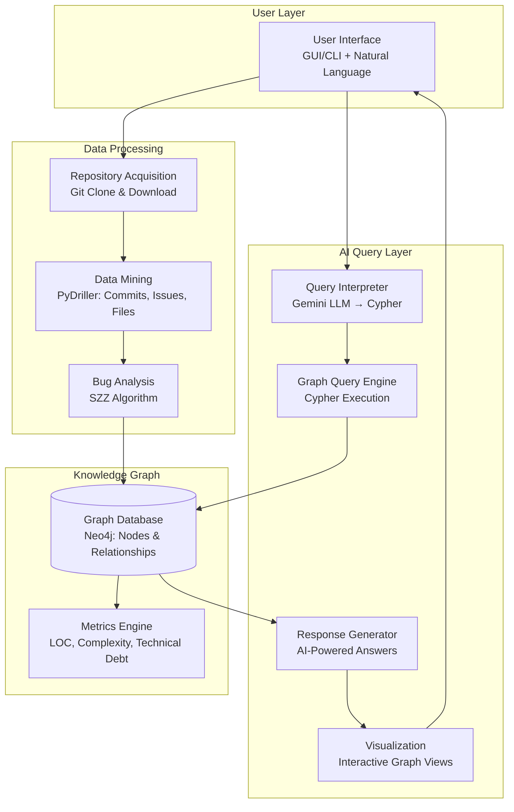
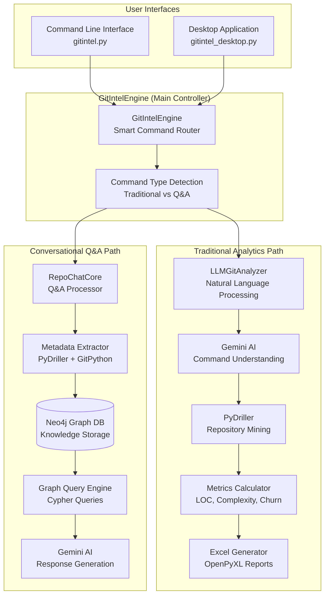
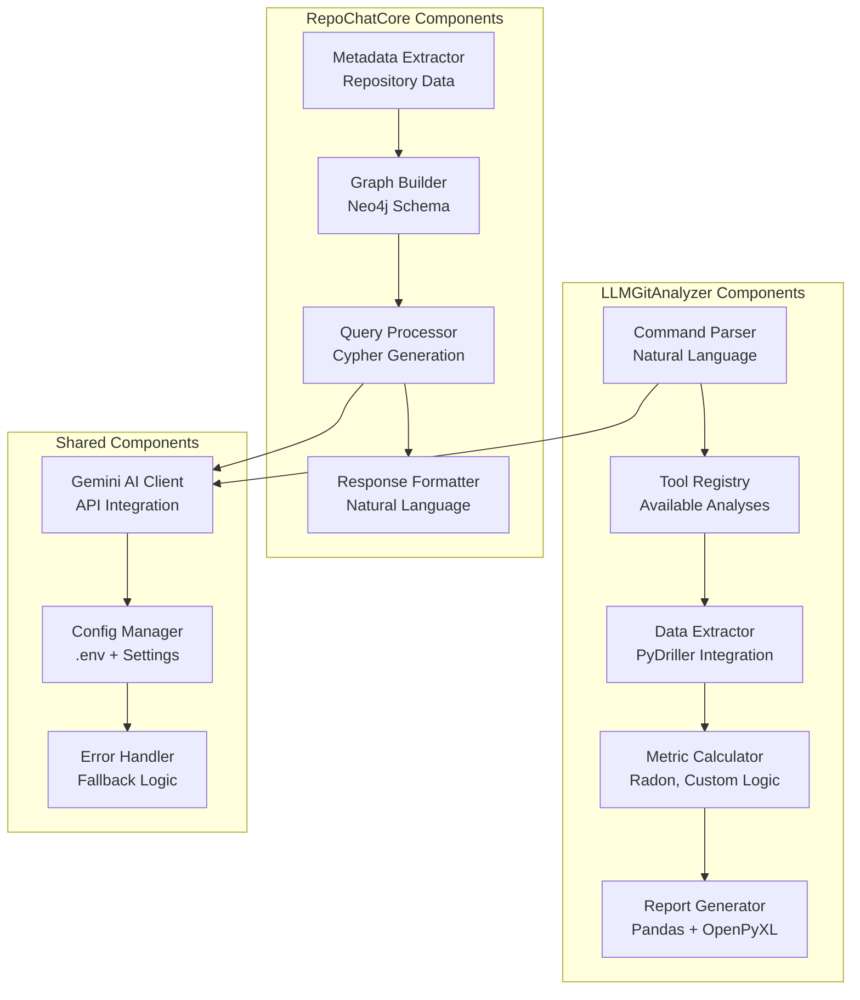
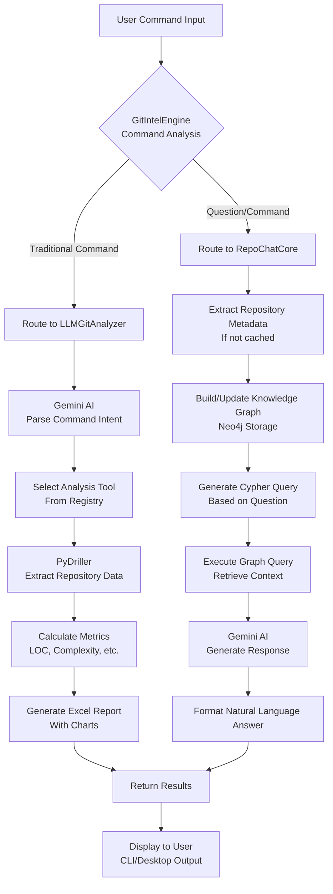
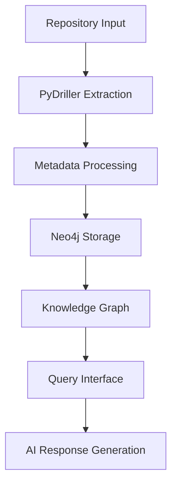
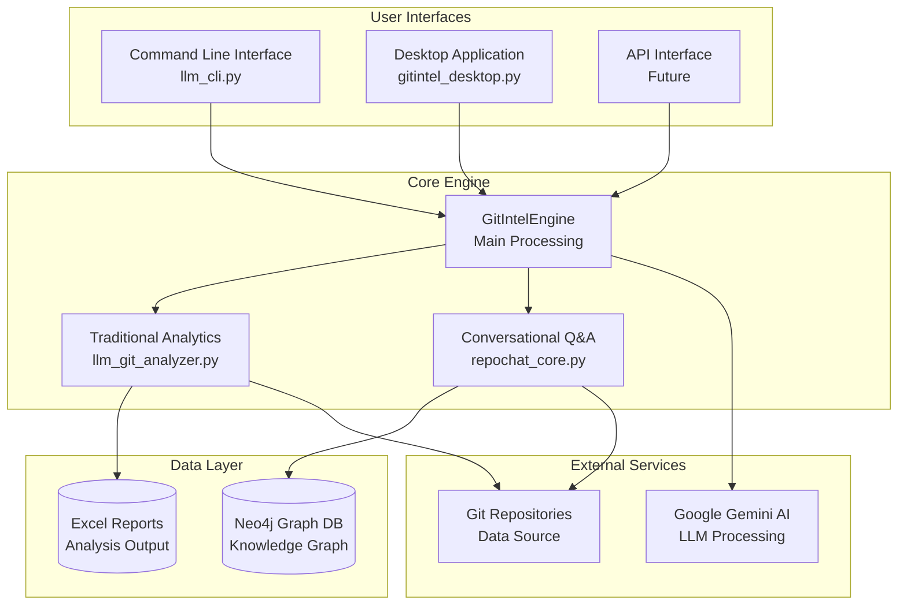
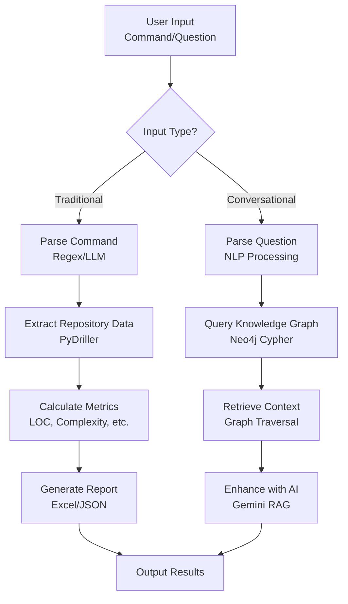
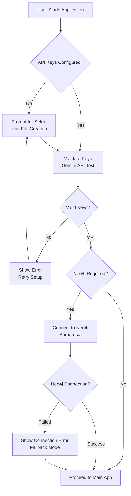
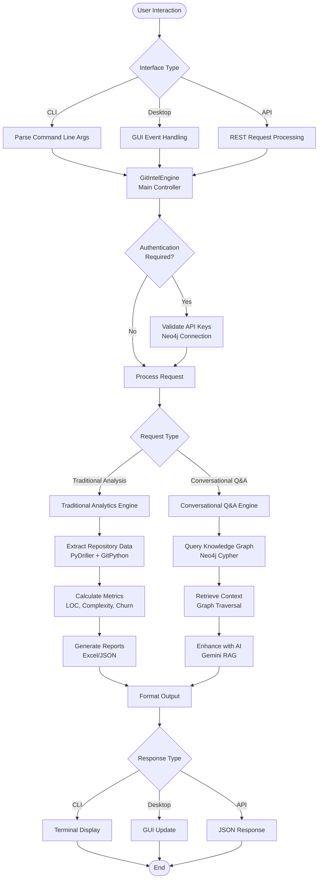

# GitIntel: Conversational Intelligence for Comprehensive GitHub Repository Analysis

## Project Description
GitIntel is a desktop-based tool that extracts data from software repositories (like GitHub), builds a Knowledge Graph, and answers user questions in natural language. It uses Neo4j graph database to accurately handle relationship-based data (e.g., commit-issue links). The SZZ algorithm identifies bug-fixing and bug-introducing commits during data extraction. It adds analysis for LOC (Lines of Code), complexity, technical debt, and tries graph visualization (Neo4j graphs viewable from the system). Goal: Easy repository insights for non-technical users (e.g., project managers).

### High-Level Architecture Diagram

```mermaid
graph TB
    subgraph "User Layer"
        UI[User Interface<br/>GUI/CLI + Natural Language]
    end
    
    subgraph "Data Processing"
        Clone[Repository Acquisition<br/>Git Clone & Download]
        Extract[Data Mining<br/>PyDriller: Commits, Issues, Files]
        SZZ[Bug Analysis<br/>SZZ Algorithm]
    end
    
    subgraph "Knowledge Graph"
        Neo4j[(Graph Database<br/>Neo4j: Nodes & Relationships)]
        LOC[Metrics Engine<br/>LOC, Complexity, Technical Debt]
    end
    
    subgraph "AI Query Layer"
        LLM[Query Interpreter<br/>Gemini LLM → Cypher]
        Cypher[Graph Query Engine<br/>Cypher Execution]
        Response[Response Generator<br/>AI-Powered Answers]
        Viz[Visualization<br/>Interactive Graph Views]
    end
    
    UI --> Clone
    Clone --> Extract
    Extract --> SZZ
    SZZ --> Neo4j
    Neo4j --> LOC
    UI --> LLM
    LLM --> Cypher
    Cypher --> Neo4j
    Neo4j --> Response
    Response --> Viz
    Viz --> UI
```

**Data Flow**: User Input → Repository Processing → Data Mining → Bug Analysis → Graph Storage → Metrics → AI Query → Graph Search → Intelligent Response → Visualization

---

## Project Description
Analyzing large GitHub repositories can be challenging due to thousands of commits, hundreds of files, and contributions from multiple developers. It's often difficult to know which parts of the project are changing most, who is contributing what, and how the codebase is evolving over time. GitIntel is a smart, chat-based tool that simplifies this process. It extracts structured data like code churn, package-level activity, and developer contributions, and provides clear, human-readable explanations that help users quickly explore and understand even the largest repositories.

## Problem Statement & Objectives
Understanding the evolution of large software projects is challenging and time-consuming. Developers, researchers, and project managers often struggle to track changes, identify key contributors, and assess module complexity. Existing tools either provide raw data or require deep technical expertise to interpret.

The main objective of GitIntel is to provide an easy-to-use, AI-powered platform that automatically analyzes GitHub repositories and delivers actionable insights in natural language. It aims to help users monitor project activity, understand code evolution, and make informed decisions without manually sifting through commits and files.

## Proposed Solution
- **Commit History Analysis**: Use Python tools like PyDriller and GitPython to extract structured data from GitHub repositories.
- **Code Metrics Extraction**: Track code churn (added, deleted, modified lines), package-level activity, and developer contributions.
- **AI-Powered Chat Interface**: Provide human-readable explanations and allow users to ask questions in natural language (Which module changed the most?).
- **Actionable Insights**: Deliver clear, concise summaries that help users understand project evolution without manually browsing commits.
- **Visualization**: Use Neo4j or similar tools to create knowledge graphs for collaboration patterns and module dependencies.
- **Efficient Exploration**: Enable developers, researchers, and project managers to explore large repositories quickly and make informed decisions.

## Key Technologies & Tools
- **Language**: Python
- **Repository Analysis**: PyDriller, GitPython
- **Data Processing & Reporting**: Pandas, OpenPyXL
- **Conversational & AI Integration**: Google Generative AI (Gemini)
- **Knowledge Graph & Visualization**: Neo4j
- **CLI & Utilities**: argparse, logging, pathlib, json, datetime
- **GUI Framework**: Tkinter
- **Version Control**: Git, GitHub

## Features
- **Natural Language Commands**: Bengali/English commands for analysis
- **Git Repository Cloning**: Clone any GitHub repo for analysis
- **Commit Limit Control**: Analyze specific number of commits (performance optimization)
- **Progress Tracking**: Real-time progress indicators during analysis
- **Automated Analysis**: Package churn, LOC, complexity, release-wise changes
- **Excel Report Generation**: Results saved as `.xlsx` files
- **Fallback System**: Simple command parsing when LLM quota exceeded

## Installation
```pwsh
# Install dependencies
pip install -r requirements.txt

# Set up Gemini API key (create .env file)
echo "GEMINI_API_KEY=your_api_key_here" > .env
```

## Neo4j Setup (Optional - for Knowledge Graph)

### Option 1: Neo4j Aura (Cloud - Recommended)
1. **Sign up:** https://neo4j.com/cloud/aura/
2. **Free tier:** Select "Free" plan (200k nodes, 400k relationships)
3. **Create instance:** Name it "GitIntel"
4. **Get connection details:** Copy the connection URI (neo4j+s://xxxxx.databases.neo4j.io)
5. **Test connection:**
```pwsh
python test_neo4j.py
# Enter your Aura URI and password when prompted
```

### Option 2: Neo4j Desktop (Local)
- Download from: https://neo4j.com/download-center/
- Choose "Neo4j Desktop" for Windows
- Install and run the installer
- Create a new project and database
- Start the database (default: bolt://localhost:7687)
- Default credentials: neo4j/neo4j (change password on first login)

### Use with GitIntel
```pwsh
# For Aura (replace with your URI)
python git_analyzer_tool.py D:\GitIntel\kafka --create-graph --neo4j-uri "neo4j+s://your-instance.databases.neo4j.io" --neo4j-password your_password

# For Desktop
python git_analyzer_tool.py D:\GitIntel\kafka --create-graph --neo4j-password your_password

# View graph in Neo4j Browser at http://localhost:7474/browser or your Aura instance
# Query examples:
# MATCH (n) RETURN n LIMIT 25
# MATCH (a:Author)-[:COMMITTED]->(c:Commit) RETURN a,c LIMIT 50
# MATCH (p:Package) WHERE p.total_churn > 1000 RETURN p
```
```pwsh
# Run analysis with Neo4j graph creation
python git_analyzer_tool.py D:\GitIntel\kafka --create-graph --neo4j-password your_password

# View graph in Neo4j Browser at http://localhost:7474
# Query examples:
# MATCH (n) RETURN n LIMIT 25
# MATCH (a:Author)-[:COMMITTED]->(c:Commit) RETURN a,c LIMIT 50
```

## Usage

### Clone and Analyze Remote Repositories
```pwsh
python llm_cli.py "clone https://github.com/SeleniumHQ/selenium"
python llm_cli.py "clone https://github.com/apache/maven"
```

### Analysis with Commit Limits (Performance Optimization)
```pwsh
python llm_cli.py "package churn first 500 commits"
python llm_cli.py "loc per month first 1000 commits"
python llm_cli.py "complexity first 200 commits"
```

### Natural Language Commands
```pwsh
python llm_cli.py "আমাকে 500+ line changes এর Excel দাও"
python llm_cli.py "LOC analysis report দাও"
python llm_cli.py "complexity analysis করো"
python llm_cli.py "release wise changes দেখাও"
python llm_cli.py "loc per month according to package"
```

### Simple Commands (Works without LLM)
```pwsh
python llm_cli.py "loc per month first 100"
python llm_cli.py "package churn first 50"
python llm_cli.py "complexity"
python llm_cli.py "releases"
```

## Supported Repositories
- ✅ **Apache Kafka** (D:\GitIntel\kafka) - Large-scale enterprise repository
- ✅ **Apache Maven** (cloned from GitHub) - Build tool with complex package structure  
- ✅ **Selenium** (cloned from GitHub) - Testing framework with multiple modules
- ✅ **Spring Boot** (D:\GitIntel\Spring-Boot-in-Detailed-Way) - Framework with extensive documentation
- ✅ **Any Java repository** (local or GitHub) - Automatic package detection and analysis

## Output Files
All reports are timestamped Excel files:
- `package_churn_analysis_20251030_124511.xlsx`
- `loc_time_ratio_analysis_20251030_124248.xlsx`
- `complexity_analysis_20251030_124722.xlsx`

## System Working Flow

### Architecture Overview
```
User Input (CLI/Desktop) → GitIntelEngine → Command Routing
                                      ↓
                    ┌─────────────────┼─────────────────┐
                    │                                 │
         Traditional Analytics              Conversational Q&A
         (LLMGitAnalyzer)                   (RepoChatCore)
                 ↓                                 ↓
        Gemini AI Processing            Metadata Extraction
                 ↓                                 ↓
        PyDriller Data Mining           Neo4j Knowledge Graph
                 ↓                                 ↓
        Metrics Calculation            Gemini AI Response
                 ↓                                 ↓
        Excel Report Generation         Natural Language Answer
```

### High-Level Architecture

```mermaid
graph TB
    subgraph "User Interfaces"
        CLI[Command Line Interface<br/>gitintel.py]
        Desktop[Desktop Application<br/>gitintel_desktop.py]
    end
    
    subgraph "GitIntelEngine (Main Controller)"
        Engine[GitIntelEngine<br/>Smart Command Router]
        Router[Command Type Detection<br/>Traditional vs Q&A]
    end
    
    subgraph "Traditional Analytics Path"
        LLM_Analyzer[LLMGitAnalyzer<br/>Natural Language Processing]
        Gemini_Trad[Gemini AI<br/>Command Understanding]
        PyDriller[PyDriller<br/>Repository Mining]
        Metrics[Metrics Calculator<br/>LOC, Complexity, Churn]
        Excel[Excel Generator<br/>OpenPyXL Reports]
    end
    
    subgraph "Conversational Q&A Path"
        RepoChat[RepoChatCore<br/>Q&A Processor]
        Metadata[Metadata Extractor<br/>PyDriller + GitPython]
        Neo4j[(Neo4j Graph DB<br/>Knowledge Storage)]
        Query[Graph Query Engine<br/>Cypher Queries]
        Gemini_QA[Gemini AI<br/>Response Generation]
    end
    
    CLI --> Engine
    Desktop --> Engine
    
    Engine --> Router
    Router --> LLM_Analyzer
    Router --> RepoChat
    
    LLM_Analyzer --> Gemini_Trad
    Gemini_Trad --> PyDriller
    PyDriller --> Metrics
    Metrics --> Excel
    
    RepoChat --> Metadata
    Metadata --> Neo4j
    Neo4j --> Query
    Query --> Gemini_QA
```

### Component Architecture

```mermaid
graph TB
    subgraph "LLMGitAnalyzer Components"
        CommandParser[Command Parser<br/>Natural Language]
        ToolRegistry[Tool Registry<br/>Available Analyses]
        DataExtractor[Data Extractor<br/>PyDriller Integration]
        MetricCalculator[Metric Calculator<br/>Radon, Custom Logic]
        ReportGenerator[Report Generator<br/>Pandas + OpenPyXL]
    end
    
    subgraph "RepoChatCore Components"
        MetadataExtractor[Metadata Extractor<br/>Repository Data]
        GraphBuilder[Graph Builder<br/>Neo4j Schema]
        QueryProcessor[Query Processor<br/>Cypher Generation]
        ResponseFormatter[Response Formatter<br/>Natural Language]
    end
    
    subgraph "Shared Components"
        GeminiClient[Gemini AI Client<br/>API Integration]
        ConfigManager[Config Manager<br/>.env + Settings]
        ErrorHandler[Error Handler<br/>Fallback Logic]
    end
    
    CommandParser --> ToolRegistry
    ToolRegistry --> DataExtractor
    DataExtractor --> MetricCalculator
    MetricCalculator --> ReportGenerator
    
    MetadataExtractor --> GraphBuilder
    GraphBuilder --> QueryProcessor
    QueryProcessor --> ResponseFormatter
    
    CommandParser --> GeminiClient
    QueryProcessor --> GeminiClient
    GeminiClient --> ConfigManager
    ConfigManager --> ErrorHandler
```

### Analysis Workflow

```mermaid
graph TD
    A[User Command Input] --> B{GitIntelEngine<br/>Command Analysis}
    
    B -->|Traditional Command| C[Route to LLMGitAnalyzer]
    B -->|Question/Command| D[Route to RepoChatCore]
    
    C --> E[Gemini AI<br/>Parse Command Intent]
    E --> F[Select Analysis Tool<br/>From Registry]
    F --> G[PyDriller<br/>Extract Repository Data]
    G --> H[Calculate Metrics<br/>LOC, Complexity, etc.]
    H --> I[Generate Excel Report<br/>With Charts]
    I --> J[Return Results]
    
    D --> K[Extract Repository Metadata<br/>If not cached]
    K --> L[Build/Update Knowledge Graph<br/>Neo4j Storage]
    L --> M[Generate Cypher Query<br/>Based on Question]
    M --> N[Execute Graph Query<br/>Retrieve Context]
    N --> O[Gemini AI<br/>Generate Response]
    O --> P[Format Natural Language Answer]
    P --> J
    
    J --> Q[Display to User<br/>CLI/Desktop Output]
```

### Complete System Flow
```mermaid
graph TD
    Start([User Starts GitIntel]) --> Interface{Choose Interface}
    
    Interface -->|CLI| CLI_Init[Parse CLI Arguments<br/>--repo, --command, --ask]
    Interface -->|Desktop| GUI_Init[Launch Tkinter App<br/>Repository Selection]
    
    CLI_Init --> Engine_Init[Initialize GitIntelEngine<br/>Setup Components]
    GUI_Init --> Engine_Init
    
    Engine_Init --> Repo_Check{Repository Set?}
    Repo_Check -->|No| Repo_Setup[Auto-detect or Prompt<br/>Repository Path]
    Repo_Check -->|Yes| Command_Ready[Ready for Commands]
    
    Repo_Setup --> Command_Ready
    
    Command_Ready --> Input_Loop{Wait for Input}
    
    Input_Loop -->|Traditional Command| Trad_Path[LLMGitAnalyzer Path<br/>"package churn analysis"]
    Input_Loop -->|Question| QA_Path[RepoChatCore Path<br/>"Who contributed most?"]
    Input_Loop -->|System Command| Sys_Path[Handle Special Commands<br/>help, status, quit]
    
    Trad_Path --> Gemini_Parse[Gemini AI Processing<br/>Understand Intent]
    Gemini_Parse --> Tool_Select[Select Analysis Tool<br/>From Available Tools]
    Tool_Select --> Data_Mine[PyDriller Data Mining<br/>Commits, Files, Changes]
    Data_Mine --> Metric_Calc[Calculate Metrics<br/>Pandas Processing]
    Metric_Calc --> Excel_Gen[Generate Excel Report<br/>Charts & Tables]
    Excel_Gen --> Output_Result[Display Results<br/>File Paths & Summary]
    
    QA_Path --> Metadata_Check{Metadata Available?}
    Metadata_Check -->|No| Extract_Meta[Extract Repository Metadata<br/>Contributors, Commits, Files]
    Metadata_Check -->|Yes| Graph_Query[Query Knowledge Graph<br/>Neo4j Cypher]
    
    Extract_Meta --> Graph_Store[Store in Neo4j Graph<br/>Nodes & Relationships]
    Graph_Store --> Graph_Query
    
    Graph_Query --> Context_Retrieve[Retrieve Relevant Context<br/>Graph Traversal]
    Context_Retrieve --> AI_Response[Gemini AI Response<br/>Natural Language Generation]
    AI_Response --> Format_Output[Format Answer<br/>User-Friendly Text]
    Format_Output --> Output_Result
    
    Sys_Path --> Handle_Sys[Execute System Command<br/>Status, Help, etc.]
    Handle_Sys --> Output_Result
    
    Output_Result --> Input_Loop
    
    Input_Loop -->|Exit Command| End([End Session])
```

### Repository Analysis Workflow

```mermaid
graph TD
    A[Repository Input] --> B[PyDriller Extraction]
    B --> C[Metadata Processing]
    C --> D[Neo4j Storage]
    D --> E[Knowledge Graph]
    E --> F[Query Interface]
    F --> G[AI Response Generation]
```

### High-Level Architecture

```mermaid
graph TB
    subgraph "User Interfaces"
        CLI[Command Line Interface<br/>llm_cli.py]
        Desktop[Desktop Application<br/>gitintel_desktop.py]
        API[API Interface<br/>Future]
    end
    
    subgraph "Core Engine"
        Engine[GitIntelEngine<br/>Main Processing]
        Traditional[Traditional Analytics<br/>llm_git_analyzer.py]
        Conversational[Conversational Q&A<br/>repochat_core.py]
    end
    
    subgraph "Data Layer"
        Neo4j[(Neo4j Graph DB<br/>Knowledge Graph)]
        Excel[(Excel Reports<br/>Analysis Output)]
    end
    
    subgraph "External Services"
        Gemini[Google Gemini AI<br/>LLM Processing]
        Git[Git Repositories<br/>Data Source]
    end
    
    CLI --> Engine
    Desktop --> Engine
    API --> Engine
    
    Engine --> Traditional
    Engine --> Conversational
    
    Traditional --> Excel
    Conversational --> Neo4j
    
    Traditional --> Git
    Conversational --> Git
    Engine --> Gemini
```

### Component Architecture

```mermaid
graph TB
    subgraph "Traditional Analytics Engine"
        PyDriller[PyDriller<br/>Repository Mining]
        Pandas[Pandas<br/>Data Processing]
        OpenPyXL[OpenPyXL<br/>Excel Generation]
        Radon[Radon<br/>Complexity Analysis]
    end
    
    subgraph "Conversational Q&A Engine"
        Neo4jDriver[Neo4j Driver<br/>Graph Operations]
        NLP[NLP Processing<br/>Question Parsing]
        RAG[RAG System<br/>Context Enhancement]
        GeminiAPI[Gemini API<br/>Response Generation]
    end
    
    subgraph "Unified CLI Interface"
        Argparse[Argparse<br/>Command Parsing]
        Rich[Rich<br/>Enhanced CLI]
        Click[Click<br/>CLI Framework]
    end
    
    subgraph "Desktop Application"
        Tkinter[Tkinter<br/>GUI Framework]
        Matplotlib[Matplotlib<br/>Charts]
        Threading[Threading<br/>Background Processing]
    end
    
    PyDriller --> Pandas
    Pandas --> OpenPyXL
    Pandas --> Radon
    
    Neo4jDriver --> NLP
    NLP --> RAG
    RAG --> GeminiAPI
    
    Argparse --> Rich
    Rich --> Click
    
    Tkinter --> Matplotlib
    Matplotlib --> Threading
```

### Analysis Workflow

```mermaid
graph TD
    A[User Input<br/>Command/Question] --> B{Input Type?}
    B -->|Traditional| C[Parse Command<br/>Regex/LLM]
    B -->|Conversational| D[Parse Question<br/>NLP Processing]
    
    C --> E[Extract Repository Data<br/>PyDriller]
    D --> F[Query Knowledge Graph<br/>Neo4j Cypher]
    
    E --> G[Calculate Metrics<br/>LOC, Complexity, etc.]
    F --> H[Retrieve Context<br/>Graph Traversal]
    
    G --> I[Generate Report<br/>Excel/JSON]
    H --> J[Enhance with AI<br/>Gemini RAG]
    
    I --> K[Output Results]
    J --> K
```

### Authentication Flow

```mermaid
graph TD
    A[User Starts Application] --> B{API Keys Configured?}
    B -->|No| C[Prompt for Setup<br/>.env File Creation]
    B -->|Yes| D[Validate Keys<br/>Gemini API Test]
    
    C --> D
    D --> E{Valid Keys?}
    E -->|No| F[Show Error<br/>Retry Setup]
    E -->|Yes| G{Neo4j Required?}
    
    F --> C
    G -->|Yes| H[Connect to Neo4j<br/>Aura/Local]
    G -->|No| I[Proceed to Main App]
    
    H --> J{Neo4j Connection?}
    J -->|Success| I
    J -->|Failed| K[Show Connection Error<br/>Fallback Mode]
    
    K --> I
```

### Complete System Flow

```mermaid
graph TD
    Start([User Interaction]) --> Interface{Interface Type}
    
    Interface -->|CLI| CLI_Process[Parse Command Line Args]
    Interface -->|Desktop| GUI_Process[GUI Event Handling]
    Interface -->|API| API_Process[REST Request Processing]
    
    CLI_Process --> Engine[GitIntelEngine<br/>Main Controller]
    GUI_Process --> Engine
    API_Process --> Engine
    
    Engine --> Auth{Authentication<br/>Required?}
    Auth -->|Yes| Auth_Flow[Validate API Keys<br/>Neo4j Connection]
    Auth -->|No| Process[Process Request]
    
    Auth_Flow --> Process
    Process --> Type{Request Type}
    
    Type -->|Traditional Analysis| Traditional_Engine[Traditional Analytics Engine]
    Type -->|Conversational Q&A| Conversational_Engine[Conversational Q&A Engine]
    
    Traditional_Engine --> Data_Extract[Extract Repository Data<br/>PyDriller + GitPython]
    Conversational_Engine --> Graph_Query[Query Knowledge Graph<br/>Neo4j Cypher]
    
    Data_Extract --> Metrics_Calc[Calculate Metrics<br/>LOC, Complexity, Churn]
    Graph_Query --> Context_Retrieval[Retrieve Context<br/>Graph Traversal]
    
    Metrics_Calc --> Report_Gen[Generate Reports<br/>Excel/JSON]
    Context_Retrieval --> AI_Enhance[Enhance with AI<br/>Gemini RAG]
    
    Report_Gen --> Output[Format Output]
    AI_Enhance --> Output
    
    Output --> Response{Response Type}
    Response -->|CLI| Terminal_Output[Terminal Display]
    Response -->|Desktop| GUI_Update[GUI Update]
    Response -->|API| JSON_Response[JSON Response]
    
    Terminal_Output --> End([End])
    GUI_Update --> End
    JSON_Response --> End
```

### New Features in Detail

#### 1. **Git Repository Cloning**
```python
# Clone any GitHub repository
python llm_cli.py "clone https://github.com/apache/maven"

# Automatic repository detection and setup
✅ Repository cloned successfully!
✅ Repository set: D:\GitIntel\maven
```

#### 2. **Commit Limit Control**
```python
# Process only first N commits for faster analysis
python llm_cli.py "loc analysis first 500 commits"

# Progress tracking
📊 Processing commits (limit: 500, total: 16511)...
   📈 Processed 100 commits...
   📈 Processed 200 commits...
   ⏹️ Reached commit limit of 500
```

#### 3. **Enhanced Progress Tracking**
- Real-time commit processing count
- Time estimates for large repositories
- Memory usage optimization for big datasets

#### 4. **Fallback Command System**
When LLM quota is exceeded, simple regex-based parsing:
```python
# These work without LLM
"loc per month first 100"  → analyze_loc_time_ratio(limit=100)
"package churn first 50"   → analyze_package_churn(limit=50)  
"complexity"               → analyze_complexity()
```

### Performance Optimizations
- **Commit Limits**: Process 100-1000 commits instead of full history
- **Progress Indicators**: Show processing status every 50-100 commits
- **Memory Management**: Stream processing for large repositories
- **Selective Analysis**: Focus on Java files only

## Advanced Usage

### Repository Management
```pwsh
# Set specific repository
python llm_cli.py "set_repo D:/GitIntel/kafka"

# Clone and switch
python llm_cli.py "clone https://github.com/spring-projects/spring-boot"
```

### Custom Analysis Parameters
```pwsh
# Custom threshold for package churn
python llm_cli.py "package changes over 1000 lines"

# Time-based analysis
python llm_cli.py "loc per month according to package"
python llm_cli.py "complexity time ratio first 200"
```

## Error Handling
- **LLM Quota Exceeded**: Automatic fallback to simple command parsing
- **Network Issues**: Local repository analysis continues
- **Large Repositories**: Commit limit prevents memory issues
- **Invalid Repositories**: Clear error messages and suggestions

## Requirements
- Python 3.13+
- Google Gemini API key in `.env` as `GEMINI_API_KEY`
- Git installed (for cloning repositories)
- ~2GB RAM for large repository analysis

## License
MIT
